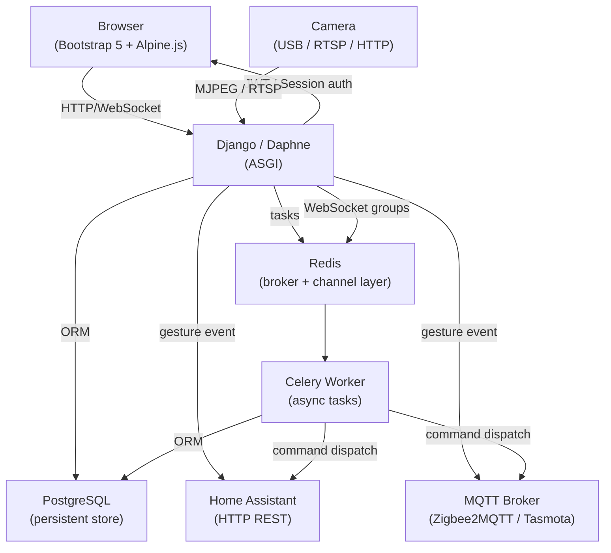

# YOLO Gesture Home Automation

[](https://github.com/caobaichuan1122/gesture-smart-home/actions/workflows/ci.yml)
[](https://github.com/caobaichuan1122/gesture-smart-home/actions/workflows/cd.yml)

A Django-based computer vision server that combines real-time camera streaming, YOLOv5 object detection, and MediaPipe gesture recognition with smart home automation. Detected gestures trigger commands over HTTP, MQTT, WebSocket, or shell.

---

## Features

- **Live MJPEG stream** — view cameras in the browser with detection overlays
- **Object detection** — YOLOv5 detects objects and saves snapshot events
- **Gesture recognition** — MediaPipe detects hand and body gestures in real time
- **Smart home commands** — gestures trigger HTTP requests, MQTT publishes, WebSocket broadcasts, or shell commands
- **Auto self-capture** — gesture recognition runs automatically on server start with no browser required
- **REST API** — full CRUD for cameras, gestures, commands, and mappings
- **WebSocket events** — real-time push for detection and automation events
- **Trigger history** — every gesture trigger is logged with a snapshot

---

## Tech Stack

| Layer | Technology |
|-------|------------|
| **Web framework** | [Django 5.x](https://www.djangoproject.com/) + Django REST Framework |
| **Async / WebSocket** | Django Channels + Daphne (ASGI) |
| **Authentication** | JWT via `djangorestframework-simplejwt` |
| **Task queue** | Celery + Redis (async command dispatch) |
| **Channel layer** | `channels-redis` (Redis-backed WebSocket groups) |
| **Computer vision** | OpenCV, YOLOv5, MediaPipe |
| **Database** | PostgreSQL 15 (with custom DB indexes) |
| **Messaging** | MQTT (`paho-mqtt`) |
| **API docs** | drf-spectacular (OpenAPI 3.0 / ReDoc / Swagger) |
| **Error monitoring** | Sentry SDK |
| **Frontend** | Bootstrap 5.3 + Alpine.js (no build step) |
| **Load testing** | Locust |
| **Containerization** | Docker + docker-compose + Kubernetes |

---

## Built-in Gestures

**Body pose** (requires upper body visible):

| Gesture | Description |
|---------|-------------|
| `raise_right_hand` | Right wrist above right shoulder |
| `raise_left_hand` | Left wrist above left shoulder |
| `raise_both_hands` | Both wrists above shoulders |
| `t_pose` | Arms spread wide, wrists level with shoulders |
| `clap` | Both wrists close together at chest height |

**Hand gestures** (MediaPipe built-in model):

`thumbs_up` · `thumbs_down` · `victory` · `pointing_up` · `open_palm` · `fist` · `iloveyou`

---

## Requirements

- Python 3.8+
- PostgreSQL
- MQTT broker (optional)
- Model files: `gesture_recognizer.task`, `pose_landmarker.task` (place in project root)

---

## Installation

```bash
# 1. Create and activate virtual environment
python -m venv .venv
.venv\Scripts\activate        # Windows
# source .venv/bin/activate   # Linux/macOS

# 2. Install dependencies
pip install -r requirements.txt

# 3. Configure environment
copy .env.example .env        # edit DB credentials and settings

# 4. Create database and apply migrations
python manage.py migrate

# 5. Create admin user
python manage.py createsuperuser
```

---

## Configuration

Copy `.env.example` to `.env` and fill in your values:

```env
SECRET_KEY=your-secret-key
DEBUG=True
ALLOWED_HOSTS=*

# PostgreSQL
DB_NAME=yolo
DB_USER=postgres
DB_PASSWORD=yourpassword
DB_HOST=localhost
DB_PORT=5432

# Redis (Celery broker + Django Channels layer)
REDIS_URL=redis://localhost:6379/0

# MQTT (optional)
MQTT_HOST=localhost
MQTT_PORT=1883
MQTT_USER=
MQTT_PASSWORD=

# Sentry error monitoring (optional)
SENTRY_DSN=
```

### Environment variables reference

| Variable | Required | Default | Description |
|----------|----------|---------|-------------|
| `SECRET_KEY` | ✅ | — | Django secret key |
| `DEBUG` | — | `False` | Enable debug mode |
| `ALLOWED_HOSTS` | ✅ | — | Comma-separated host list |
| `DB_NAME` | ✅ | — | PostgreSQL database name |
| `DB_USER` | ✅ | — | PostgreSQL user |
| `DB_PASSWORD` | ✅ | — | PostgreSQL password |
| `DB_HOST` | ✅ | `localhost` | PostgreSQL host |
| `DB_PORT` | — | `5432` | PostgreSQL port |
| `REDIS_URL` | ✅ | `redis://localhost:6379/0` | Redis URL (Celery + Channels) |
| `MQTT_HOST` | — | — | MQTT broker hostname |
| `MQTT_PORT` | — | `1883` | MQTT broker port |
| `MQTT_USER` | — | — | MQTT username |
| `MQTT_PASSWORD` | — | — | MQTT password |
| `SENTRY_DSN` | — | — | Sentry DSN for error monitoring |

---

## Running

```bash
# Development server
python manage.py runserver

# Production (ASGI — required for WebSocket support)
daphne -b 0.0.0.0 -p 8000 yolo.asgi:application
```

On startup, enabled cameras with `gesture_enabled=True` automatically begin capturing frames and recognizing gestures — no browser connection needed.

---

## Quick Setup: Gesture → Command

```bash
python manage.py shell -c "
from yolo_app.models import GestureAction, HomeCommand, GestureCommandMapping

gesture = GestureAction.objects.create(
    name='thumbs_up', hold_frames=10, cooldown_seconds=5
)
cmd = HomeCommand.objects.create(
    name='Open Calculator', command_type='shell', shell_command='calc.exe'
)
GestureCommandMapping.objects.create(gesture=gesture, command=cmd)
print('Done')
"
```

Or configure everything through the Django Admin at `http://localhost:8000/admin/`.

---

## API Documentation

Interactive API documentation is available automatically once the server is running.

| URL | Tool | Description |
|-----|------|-------------|
| `/api/docs/` | **ReDoc** | Clean, readable reference documentation (recommended) |
| `/api/swagger/` | **Swagger UI** | Interactive "try it out" console |
| `/api/schema/` | OpenAPI 3.0 | Raw YAML/JSON schema — import into Postman, Insomnia, etc. |

The schema is generated automatically from the code by [drf-spectacular](https://github.com/tfranzel/drf-spectacular). All endpoints are grouped into logical tags: `cameras`, `events`, `gestures`, `commands`, `mappings`, `logs`, `devices`.

### Export the schema

```bash
# Save schema to a file (YAML by default)
python manage.py spectacular --file schema.yml

# JSON format
python manage.py spectacular --file schema.json --format json
```

---

## API Endpoints

All REST endpoints require a JWT Bearer token (except `/api/v1/auth/`).

### Authentication
| Method | Endpoint | Description |
|--------|----------|-------------|
| POST | `/api/v1/auth/token/` | Obtain access + refresh tokens |
| POST | `/api/v1/auth/token/refresh/` | Refresh access token |
| POST | `/api/v1/auth/token/verify/` | Verify token validity |
| POST | `/api/v1/auth/register/` | Register new user |

### Cameras
| Method | Endpoint | Description |
|--------|----------|-------------|
| GET/POST | `/api/v1/cameras/` | List / create cameras |
| GET/PUT/DELETE | `/api/v1/cameras/<id>/` | Retrieve / update / delete |
| GET | `/api/v1/cameras/<id>/stream/` | Live MJPEG stream |
| GET | `/api/v1/cameras/<id>/snapshot/` | Single JPEG frame |
| GET | `/api/v1/cameras/<id>/events/` | Detection events (last 50) |
| GET | `/cameras/<id>/` | Browser viewer page (session auth) |

### Gestures & Commands
| Method | Endpoint | Description |
|--------|----------|-------------|
| GET/POST | `/api/v1/gestures/` | List / create gesture actions |
| GET/PUT/DELETE | `/api/v1/gestures/<id>/` | Retrieve / update / delete |
| GET/POST | `/api/v1/commands/` | List / create home commands |
| POST | `/api/v1/commands/<id>/test/` | Manually execute a command |
| GET/POST | `/api/v1/mappings/` | List / create gesture→command mappings |
| GET | `/api/v1/trigger-logs/` | Gesture trigger history (last 100) |

### Smart Devices
| Method | Endpoint | Description |
|--------|----------|-------------|
| GET/POST | `/api/v1/devices/` | List / create smart devices (`?type=light&room=living_room` filter) |
| GET/PUT/DELETE | `/api/v1/devices/<id>/` | Retrieve / update / delete |
| POST | `/api/v1/devices/<id>/control/` | Send a control action to the device |

**Control request body:**
```json
{"action": "turn_on", "params": {"brightness": 200}}
```

Supported actions per device type:

| Device | Actions |
|--------|---------|
| `light` | `turn_on` `turn_off` `set_brightness(brightness: 0-255)` |
| `curtain` | `open` `close` `set_position(position: 0-100)` |
| `tv` | `turn_on` `turn_off` `set_volume(volume_level: 0.0-1.0)` `pause` |
| `ac` | `turn_on` `turn_off` `set_temperature(temperature)` `set_mode(hvac_mode)` |

**Control response:**
```json
{"status": "ok", "device": "Living Room Light", "action": "turn_on", "state": {"is_on": true, "brightness": 200}}
```

### WebSocket
| URL | Description |
|-----|-------------|
| `ws://<host>/ws/camera/<id>/` | Real-time detection events for a camera |
| `ws://<host>/ws/home/` | Real-time home automation events |

---

## Camera Sources

The system accepts three camera source types, configured per camera via the API.

| Type | `source_type` | `source` example | Notes |
|------|--------------|-----------------|-------|
| Local USB webcam | `local` | `0` | Device index (0 = first webcam); uses DirectShow on Windows |
| IP camera / NVR | `rtsp` | `rtsp://192.168.1.100:554/stream` | Any standard RTSP stream |
| HTTP MJPEG stream | `http` | `http://192.168.1.100/video` | ESP32-CAM or any MJPEG endpoint |

### Supported cameras

**Local (USB)**

Any standard USB webcam works out of the box — including laptop built-in cameras. The system requests **1280×720 @ 30 fps** from OpenCV and gracefully falls back if the camera does not support that mode.

Examples: Logitech C270 / C920, any generic USB 1080p camera, laptop built-in webcam.

**RTSP (IP cameras)**

Any camera or NVR that exposes a standard RTSP stream is supported.

Examples: Hikvision, Dahua, Reolink, TP-Link Tapo, Xiaomi (after enabling RTSP in the device app), any ONVIF-compatible camera.

**HTTP MJPEG**

Examples: ESP32-CAM running the default MJPEG sketch, any Flask/Django camera server.

---

### Camera requirements by feature

The quality requirements depend on which features are enabled for the camera.

| Feature | Minimum | Recommended | Key constraint |
|---------|---------|-------------|----------------|
| **YOLO object detection** | 720p, any frame rate | 1080p, ≥15 fps | Good ambient light |
| **Hand gesture recognition** (`thumbs_up`, `fist`, …) | 720p, ≥15 fps | 1080p, ≥30 fps | Camera must face the hand; adequate lighting |
| **Body pose recognition** (`raise_right_hand`, `t_pose`, …) | 720p, ≥15 fps | 1080p, ≥30 fps | Upper body must be fully visible; place camera 1–3 m from subject |

> Recognition accuracy is affected more by **lighting conditions and camera placement** than by resolution or price. MediaPipe performs poorly in dark environments.

### Minimum setup for local testing

A laptop's built-in webcam is sufficient for all features. Set `source_type = local` and `source = 0` — no additional hardware required.

---

## Architecture



**Request flow:**

```
Browser  ──→  Daphne (ASGI)  ──→  Django view (JWT auth)
                                       │
                  ┌─────────────────────┤
                  ▼                     ▼
          REST API (/api/v1/)    WebSocket (/ws/)
                  │                     │
                  ▼                     ▼
           Celery task          Redis channel layer
           (async)              (broadcast to clients)
```

**Per-camera gesture pipeline:**

```
CameraProcessor thread
  ├── YOLO detection  →  DetectionEvent (DB)  →  WebSocket broadcast
  └── GestureEngine   →  hold debounce  →  cooldown check
                               └── mapping lookup  →  command_executor.execute()
                                       └── GestureTriggerLog (DB)
```

---

## Command Types

| Type | Description |
|------|-------------|
| `http` | Send HTTP request (GET/POST/PUT/…) with optional JSON body and headers |
| `mqtt` | Publish a message to an MQTT topic |
| `websocket` | Broadcast a JSON payload to all connected WebSocket clients |
| `shell` | Execute a shell command or program via subprocess (fire-and-forget) |

---

## Smart Home Command Examples

The examples below show how to wire common gestures to smart home devices using the low-level `HomeCommand` API (HTTP or MQTT). For a higher-level device abstraction use the `/api/devices/` endpoints instead.

### Curtain

**HTTP (Home Assistant / REST gateway)**

```json
POST /api/commands/
{
  "name": "Open Curtain",
  "command_type": "http",
  "http_url": "http://192.168.1.10:8123/api/services/cover/open_cover",
  "http_method": "POST",
  "http_headers": {"Authorization": "Bearer <HA_TOKEN>", "Content-Type": "application/json"},
  "http_body": {"entity_id": "cover.living_room_curtain"}
}
```

**MQTT (Zigbee2MQTT / Tuya)**

```json
POST /api/commands/
{
  "name": "Open Curtain",
  "command_type": "mqtt",
  "mqtt_topic": "zigbee2mqtt/curtain/set",
  "mqtt_payload": "{\"state\": \"OPEN\"}"
}
```

---

### Light

**HTTP**

```json
POST /api/commands/
{
  "name": "Turn On Living Room Light",
  "command_type": "http",
  "http_url": "http://192.168.1.10:8123/api/services/light/turn_on",
  "http_method": "POST",
  "http_headers": {"Authorization": "Bearer <HA_TOKEN>", "Content-Type": "application/json"},
  "http_body": {"entity_id": "light.living_room", "brightness": 255}
}
```

**MQTT**

```json
POST /api/commands/
{
  "name": "Turn On Living Room Light",
  "command_type": "mqtt",
  "mqtt_topic": "home/light/living_room/set",
  "mqtt_payload": "{\"state\": \"ON\", \"brightness\": 255}"
}
```

---

### TV

**HTTP (Home Assistant media_player)**

```json
POST /api/commands/
{
  "name": "Turn On TV",
  "command_type": "http",
  "http_url": "http://192.168.1.10:8123/api/services/media_player/turn_on",
  "http_method": "POST",
  "http_headers": {"Authorization": "Bearer <HA_TOKEN>", "Content-Type": "application/json"},
  "http_body": {"entity_id": "media_player.living_room_tv"}
}
```

**MQTT**

```json
POST /api/commands/
{
  "name": "Turn On TV",
  "command_type": "mqtt",
  "mqtt_topic": "home/tv/set",
  "mqtt_payload": "{\"state\": \"ON\"}"
}
```

---

### Air Conditioner

**HTTP**

```json
POST /api/commands/
{
  "name": "Turn On AC",
  "command_type": "http",
  "http_url": "http://192.168.1.10:8123/api/services/climate/turn_on",
  "http_method": "POST",
  "http_headers": {"Authorization": "Bearer <HA_TOKEN>", "Content-Type": "application/json"},
  "http_body": {"entity_id": "climate.bedroom_ac", "temperature": 26, "hvac_mode": "cool"}
}
```

**MQTT**

```json
POST /api/commands/
{
  "name": "Turn On AC",
  "command_type": "mqtt",
  "mqtt_topic": "home/ac/bedroom/set",
  "mqtt_payload": "{\"state\": \"ON\", \"mode\": \"cool\", \"temperature\": 26}"
}
```

---

### Recommended Gesture Mappings

| Gesture | Action |
|---------|--------|
| `thumbs_up` | Turn on living room light |
| `thumbs_down` | Turn off living room light |
| `open_palm` | Open curtain |
| `fist` | Close curtain |
| `raise_right_hand` | Turn on AC (cool, 26°C) |
| `raise_left_hand` | Turn off AC |
| `victory` | Turn on TV |
| `raise_both_hands` | Turn off all devices |

Example — create a mapping via the Django shell:

```bash
python manage.py shell -c "
from yolo_app.models import GestureAction, HomeCommand, GestureCommandMapping

gesture = GestureAction.objects.create(name='open_palm', hold_frames=8, cooldown_seconds=5)
cmd = HomeCommand.objects.create(
    name='Open Curtain',
    command_type='mqtt',
    mqtt_topic='zigbee2mqtt/curtain/set',
    mqtt_payload='{\"state\": \"OPEN\"}'
)
GestureCommandMapping.objects.create(gesture=gesture, command=cmd)
print('Done')
"
```

---

## CI/CD

Two GitHub Actions workflows are included under `.github/workflows/`.

### CI (`ci.yml`)

Runs on every push and pull request to `master` / `main`.

| Job | What it does |
|-----|-------------|
| **lint** | Runs `flake8` (max line length 120, migrations excluded) |
| **test** | Spins up a PostgreSQL 15 service, applies migrations, and runs `manage.py test` against Python 3.10 and 3.11 |

> Heavy ML packages (PyTorch, MediaPipe, Ultralytics) are excluded from the CI install to keep the runner fast. Add them back if your tests require them.

### CD (`cd.yml`)

Runs on push to `master` / `main` and on version tags (`v*`).

| Job | What it does |
|-----|-------------|
| **docker** | Builds the Docker image and pushes it to GitHub Container Registry (`ghcr.io`) |
| **deploy** | SSHes into the production server, pulls the new image, and runs `docker compose up -d` + migrations |

#### Required GitHub Secrets

| Secret | Description |
|--------|-------------|
| `DEPLOY_HOST` | Production server IP or hostname |
| `DEPLOY_USER` | SSH username |
| `DEPLOY_SSH_KEY` | Private SSH key (the server must have the matching public key) |

> `GITHUB_TOKEN` is provided automatically by GitHub Actions — no manual setup needed.

### Docker

A `Dockerfile` and `docker-compose.yml` are included for local and production use.

```bash
# Build and start locally
docker compose up --build

# Apply migrations inside the running container
docker compose exec web python manage.py migrate

# Create a superuser
docker compose exec web python manage.py createsuperuser
```

---

## Testing

All tests live in `yolo_app/tests.py` and use Django's built-in test runner.

### Run the test suite

```bash
# Run all tests
python manage.py test yolo_app --verbosity=2

# Run a single test class
python manage.py test yolo_app.tests.GestureEngineTests

# Run a single test method
python manage.py test yolo_app.tests.DeviceControlHTTPTests.test_light_set_brightness
```

> The test suite mocks all external I/O (camera hardware, HTTP calls, MQTT broker, WebSocket layer, subprocess) so no physical devices or services are required.

### Test coverage

| Area | Test class(es) | What is covered |
|------|---------------|-----------------|
| **Auth** | `AuthTests` | JWT obtain / refresh, register, unauthenticated request rejected |
| **Models** | `CameraModelTests` `GestureActionModelTests` `HomeCommandModelTests` `GestureCommandMappingModelTests` `GestureTriggerLogModelTests` `SmartDeviceModelTests` | `__str__`, field defaults, FK relations, ordering, unique constraints |
| **Serializers** | `CameraSerializerTests` `HomeCommandSerializerTests` `SmartDeviceSerializerTests` `GestureCommandMappingSerializerTests` `GestureTriggerLogSerializerTests` | Field presence, read-only fields, `stream_url` / `ws_url` generation, `supported_actions` per device type |
| **Camera API** | `CameraAPITests` | CRUD, disabled camera skips `start_camera`, 404 handling, detection event list |
| **Gesture API** | `GestureAPITests` | CRUD, 404, unique name constraint |
| **Command API** | `CommandAPITests` | CRUD, `POST /test/` success / failure / 404, HTTP & MQTT command creation |
| **Mapping API** | `MappingAPITests` | Global and camera-specific mappings, CRUD |
| **Trigger Log API** | `TriggerLogAPITests` | List, `success` field |
| **Device API** | `DeviceAPITests` | CRUD, `?type` and `?room` query filters, disabled device → 403, missing action → 400, executor failure → 502 |
| **Device control — HTTP** | `DeviceControlHTTPTests` | All actions for `light` / `curtain` / `tv` / `ac` via HTTP (Home Assistant); verifies HA service URL, request body, and `is_on` / `extra_state` updates |
| **Device control — MQTT** | `DeviceControlMQTTTests` | All actions for all device types via MQTT; verifies topic (`{prefix}/set`) and JSON payload |
| **Command executor** | `CommandExecutorHTTPTests` `CommandExecutorMQTTTests` `CommandExecutorShellTests` `CommandExecutorWebSocketTests` `CommandExecutorUnknownTypeTests` | HTTP success / 4xx / network error, MQTT success / no client / publish failure, Shell `Popen` success / OSError, WebSocket `group_send`, unknown type |
| **Gesture engine** | `GestureEngineTests` | Hold-frame debounce (too few frames → no fire), cooldown blocks re-trigger, cooldown expiry re-enables trigger, unregistered gesture ignored, gesture switch resets hold count, disabled `GestureAction` skipped, disabled `HomeCommand` skipped, trigger log written on success and failure |
| **WebSocket consumers** | `CameraConsumerTests` `HomeCommandConsumerTests` | Connect / disconnect, `detection_event` broadcast received, `home_command` broadcast received |

### Writing new tests

All test helpers are defined at the top of `tests.py`:

```python
make_camera(**kwargs)   # creates a Camera with sensible defaults
make_gesture(**kwargs)  # creates a GestureAction
make_command(**kwargs)  # creates a HomeCommand (shell type by default)
make_device(**kwargs)   # creates a SmartDevice (HTTP light by default)
```

External dependencies to mock:

| Dependency | Patch target |
|------------|-------------|
| Camera manager | `yolo_app.views.camera_api.camera_manager` |
| Command executor | `yolo_app.utils.command_executor.execute` |
| HTTP requests | `urllib.request.urlopen` |
| MQTT client | `yolo_app.utils.command_executor._get_mqtt_client` |
| Shell subprocess | `subprocess.Popen` |
| WebSocket layer | `channels.layers.get_channel_layer` |
| Gesture recognizer | `yolo_app.utils.gesture_engine.GestureRecognizer` |

---

## Authentication

The API uses **JWT Bearer tokens** for authentication. Session cookies are used only for the browser-based dashboard pages.

### Obtain a token

```bash
curl -X POST http://localhost:8000/api/v1/auth/token/ \
  -H "Content-Type: application/json" \
  -d '{"username": "admin", "password": "yourpassword"}'
```

```json
{
  "access":  "eyJ...",
  "refresh": "eyJ..."
}
```

### Call a protected endpoint

```bash
curl http://localhost:8000/api/v1/cameras/ \
  -H "Authorization: Bearer eyJ..."
```

### Refresh an expired access token

```bash
curl -X POST http://localhost:8000/api/v1/auth/token/refresh/ \
  -H "Content-Type: application/json" \
  -d '{"refresh": "eyJ..."}'
```

Token lifetimes (configurable in `settings.py`):

| Token | Default lifetime |
|-------|-----------------|
| Access | 60 minutes |
| Refresh | 7 days |

---

## Kubernetes Deployment

Kubernetes manifests live in `k8s/`. They target a cluster with an NGINX Ingress controller.

```bash
# Apply all manifests in order
kubectl apply -f k8s/namespace.yaml
kubectl apply -f k8s/configmap.yaml

# Create the secret (replace base64 values first)
kubectl apply -f k8s/secret.yaml

kubectl apply -f k8s/deployment.yaml
kubectl apply -f k8s/service.yaml
kubectl apply -f k8s/ingress.yaml

# Verify
kubectl get all -n gesture-smart-home
```

| Manifest | What it creates |
|----------|----------------|
| `namespace.yaml` | `gesture-smart-home` namespace |
| `configmap.yaml` | Non-secret env vars (DB host, Redis URL, …) |
| `secret.yaml` | `SECRET_KEY`, `DB_PASSWORD`, `SENTRY_DSN` |
| `deployment.yaml` | `web` (2 replicas), `celery` (2 replicas), `redis`, `postgres` + PVC |
| `service.yaml` | ClusterIP services for `web`, `redis`, `postgres` |
| `ingress.yaml` | NGINX Ingress with WebSocket upgrade headers |

> For production, replace the in-cluster `postgres` deployment with a managed database (RDS, Cloud SQL, etc.) and the in-cluster `redis` with a managed Redis (ElastiCache, etc.).

---

## Load Testing

[Locust](https://locust.io/) load tests are defined in `locustfile.py`.

### Install

```bash
pip install locust
```

### Run with the web UI

```bash
locust -f locustfile.py --host http://localhost:8000
# Open http://localhost:8089 in the browser
```

### Run headless

```bash
locust -f locustfile.py --host http://localhost:8000 \
  --users 50 --spawn-rate 5 --run-time 60s --headless
```

### Configure credentials

```bash
export LOCUST_USERNAME=admin
export LOCUST_PASSWORD=yourpassword
```

The load test simulates a realistic user session:

| Task | Weight | What it does |
|------|--------|-------------|
| List cameras | 3 | `GET /api/v1/cameras/` |
| Camera status | 1 | `GET /api/v1/cameras/1/status/` |
| List devices | 3 | `GET /api/v1/devices/` |
| List devices by type | 2 | `GET /api/v1/devices/?type=*` |
| Control device | 1 | `POST /api/v1/devices/1/control/` |
| List gestures | 2 | `GET /api/v1/gestures/` |
| List commands | 2 | `GET /api/v1/commands/` |
| List mappings | 2 | `GET /api/v1/mappings/` |
| Trigger logs | 2 | `GET /api/v1/trigger-logs/` |
| Token refresh | 1 | `POST /api/v1/auth/token/` |
